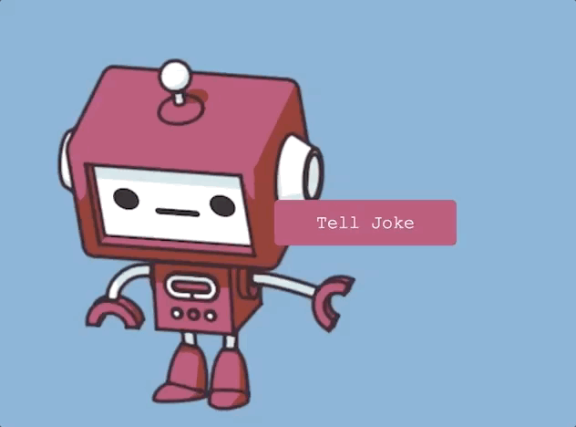

# Joke Teller
 

## About
Click the button to be told a programming joke. I specifically like the way the voice pronounces "Javascript".

To run the application you will need an API key for Voice RSS.
You can create a key via the [Voice RSS](http://www.voicerss.org/) page. You will then provide your key in the *script.js*.

## Resources Used
[JokeAPI](https://sv443.net/jokeapi/v2/)

[Voice RSS - Text-to-speech](http://www.voicerss.org/)

## Finally
Meditate and be well.
